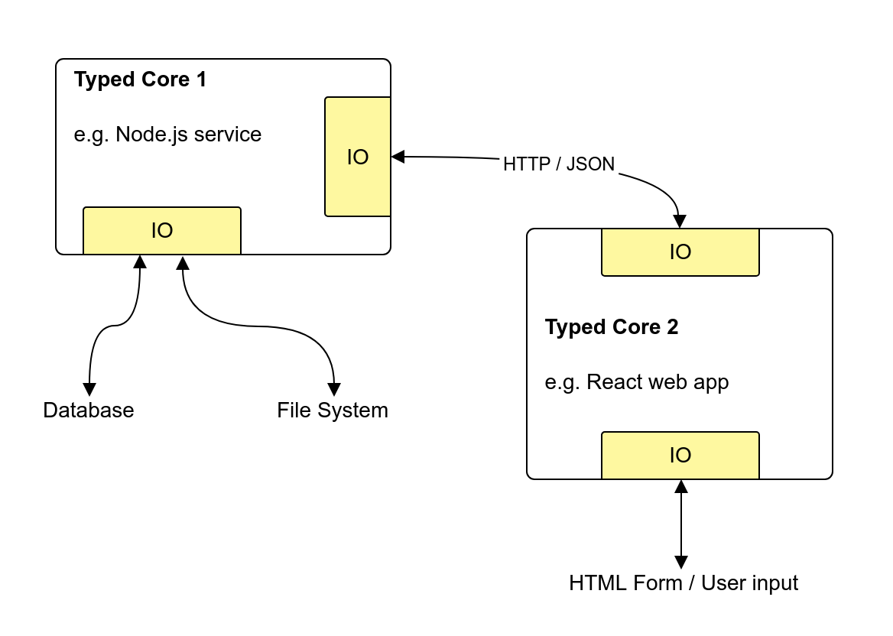
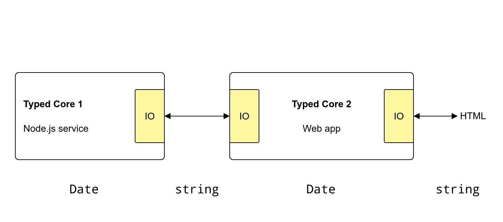

<!-- _class: lead gaia -->

# Full Stack Type Safety

## with `TypeScript` and `io-ts`

---

<!-- _class: lead -->

>)


---

<!-- _class: lead gaia -->


---

# Agenda

1. Intro to `io-ts`
2. Full stack type safety

#### Focus

Discover issues _as early as possible_

#### Example Code

github.com/giogonzo/ts-conf-talk

---

<!-- _class: lead -->

# Demo + Code Overview

## github.com/giogonzo/ts-conf-talk

#### `git checkout step-0`

---

# IO decoding / encoding

#### `TypeScript`

- Helps inside the statically typed core

#### `io-ts`

- Helps enforcing IO contracts at _runtime_
- Encourages pushing (de/en)coding to the boundary of our statycally typed cores

---



---

# Meet `io-ts`

1. Define "codecs" in the `io‑ts` DSL (values)

```ts
import * as t from "io-ts";

const User = t.type(
  {
    name: t.string,
    age: t.number,
    languages: t.array(t.string)
  },
  "User"
);
```

---

# Meet `io-ts`

1. Define "codecs" in the `io‑ts` DSL (values)

```ts
import * as t from "io-ts";

const User = // ...
```

- primitive codecs: `string`, `number`, `boolean` [and more](https://github.com/gcanti/io-ts#implemented-types--combinators)
- combinators: `array`, `type`, `union`, `intersection` [and more](https://github.com/gcanti/io-ts#implemented-types--combinators)
- companion library: github.com/gcanti/io-ts-types
- make your own codecs! `new t.Type(...)`

---

# Meet `io-ts`

2. Static types can be derived from codec values using the type‑level operator `TypeOf`

```ts
type User = t.TypeOf<typeof User>;

// equivalent to:
//
// type User = {
//   name: string;
//   age: number;
//   languages: Array<string>;
// };
```

---

# Meet `io-ts`

3. Codecs are used at runtime for decoding and encoding values

```ts
const decodeResult = User.decode(unknownValue);

// decodeResult: Either<t.Errors, User>
```

```ts
type Either<L, A> = Left<L> | Right<A>;
```

---

# Meet `io-ts`

3. Codecs are used at runtime for decoding and encoding values

```ts
const decodeResult = User.decode({
  name: "gio",
  languages: ["Italian", "TypeScript"]
});

// Left<t.Errors>
```

```ts
PathReporter.report(decodeResult);

// ["Invalid value undefined supplied to : User/age: number"]
```

---

# Meet `io-ts`

3. Codecs are used at runtime for decoding and encoding values

```ts
const decoded = User.decode({
  name: "gio",
  age: 30,
  languages: ["Italian", "TypeScript"]
});

// Right<User>
```

---

# Meet `Type<A, O>`

A codec of type Type<A, O>

- represents the static type `A` at runtime
- can encode `A` into `O`
- can decode `unknown` into `A`, or fail with validation errors

---

# Meet `Type<Date, string>`

For `User.birthDate` we'll need a codec that

- represents the static type `Date` at runtime
- can encode `Date` into `string`
- can decode the string back into `Date`, or fail with validation errors

---

# Meet `Type<Date, string>`



---

<!-- _class: lead -->

# Let's see the code

## github.com/giogonzo/ts-conf-talk

#### `git checkout step-1`

---

# Full Stack Type Safety

The idea that a breaking change in layer X results in type errors at other layers

- In our example today: changing/adding/removing API calls

---

# Full Stack Type Safety

#### Plenty of available solutions based on IDLs

- GraphQL
- OpenAPI
- ...

#### Language-dependent solutions

- E.g. `Scala` to `TypeScript` github.com/buildo/metarpheus

---

# Full Stack `TypeScript`

#### No impedance mismatch

- Same power to express concepts at both ends

#### No need for code generation

- Reuse the same code for domain definitions
- Derive features at runtime
- Enforce invariants at compile time

---

<!-- _class: lead -->

# Moar code

## github.com/giogonzo/ts-conf-talk

#### `git checkout step-2`, `step-3`, `step-4`

---

# Summary

- `TypeScript` + `io-ts` make obtaining "full stack type safety" trivial
- More in general, how we can exploit TS to find problems _earlier_
- How designing in terms of DSL + "interpreters" makes an IO contract reusable

---

<!-- _class: lead gaia -->

# `any` question?
